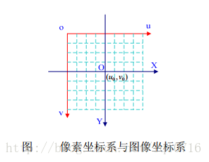
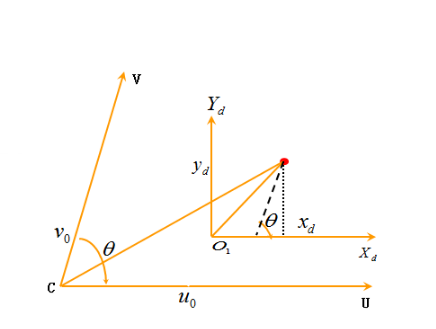
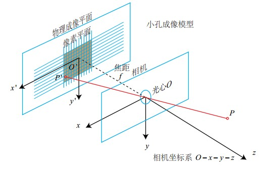
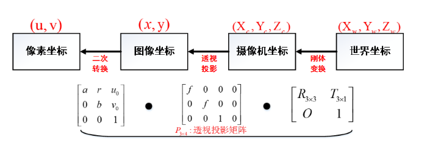

# 相机标定(Camera calibration)

## 相机标定原理与步骤
**定义：** 为确定空间物体表面某点的三维几何位置与其在图像中对应点之间的相互关系， 必须建立相机成像的几何模型这些几何模型参数就是相机参数。在大多数条件下这些参数必须通过实验与计算得出，这个求解参数的过程称为相机标定。

### 坐标系的转换
定义四个坐标系的意义，即 摄像机坐标系 、 图像物理坐标系、图像像素坐标系 和 世界坐标系(参考坐标系)

**世界坐标系转为相机坐标系**
$$
\begin{bmatrix}
    x_c\\y_c\\z_c\\1
\end{bmatrix}=
\begin{bmatrix}
    \mathbf{R} && \mathbf{t} \\ 0 && 1
\end{bmatrix}
\begin{bmatrix}
    x_\omega \\ y_\omega \\ z_\omega \\ 1
\end{bmatrix}
$$
**图像坐标系至像素坐标系**

* 像素坐标系：单位是像素(整数)，原点位于图像左上角
* 图像坐标系：单位是毫米，原点位于图像中心点
* 转换：
  $$
  \begin{bmatrix}
    u \\ v \\ 1
  \end{bmatrix}=
  \begin{bmatrix}
    1/dX && 0 && u_0 \\
    0 && 1/dY && v_0 \\
    0 && 0 && 1 \\
  \end{bmatrix}
  \begin{bmatrix}
    X \\ Y \\ 1
  \end{bmatrix}
  $$
  

此时有
$$
\begin{bmatrix}
    u \\ v \\ 1
\end{bmatrix}=
\begin{bmatrix}
    f_u && -f_u\cot\theta && u_0 \\
    0 && f_v/\sin\theta && v_0 \\
    0 && 0 && 1
\end{bmatrix}
\begin{bmatrix}
    x_d \\ y_d \\ 1
\end{bmatrix}
$$
其中$f_u=\frac{1}{dx}$, $f_v = \frac{1}{dy}$

**相机坐标系至图像坐标系**

 

由相似三角形得
$$
Z_c
\begin{bmatrix}
    x \\ y \\ 1
\end{bmatrix}=
\begin{bmatrix}
    f && 0 && 0 && 0 \\
    0 && f && 0 && 0 \\
    0 && 0 && 1 && 0 \\
\end{bmatrix} \cdot
\begin{bmatrix}
    X_c \\ Y_c \\ Z_c \\ 1
\end{bmatrix}
$$

**世界坐标系至相机坐标系**

$$
\begin{bmatrix}
X_c \\ Y_c \\ Z_c
\end{bmatrix} = 
\begin{bmatrix}
    R_{3\times 3} && T_{3\times 1} \\
    \mathbf{O} && 1
\end{bmatrix} \cdot
\begin{bmatrix}
    X_W \\ Y_W \\ Z_W \\ 1
\end{bmatrix}
$$

**合并公式**
 

$$
Z_c
\begin{bmatrix}
u \\ v \\ 1
\end{bmatrix} 
=
\begin{bmatrix}
\frac{1}{dx} && 0 && u_0 \\
0 && \frac{1}{dy} && v_0 \\
0 && 0 && 1
\end{bmatrix} 
\begin{bmatrix}
f && 0 && 0 && 0 \\
0 && f && 0 && 0 \\
0 && 0 && f && 0 
\end{bmatrix}
\begin{bmatrix}
\mathbf{R} && \mathbf{T} \\
\mathbf{O} && 1
\end{bmatrix}
\begin{bmatrix}
    X_W \\ Y_W \\ Z_W \\ 1
\end{bmatrix}\\
=
\begin{bmatrix}
f_x & 0 & u_0 & 0 \\
0 & f_y & v_0 & 0 \\
0 & 0 & 1 & 0
\end{bmatrix}
\begin{bmatrix}
\mathbf{R} & \mathbf{T} \\
0 & 1
\end{bmatrix}
\begin{bmatrix}
    X_W \\ Y_W \\ Z_W \\ 1
\end{bmatrix}
$$

其中， dx和dy为像元宽度，fx和fy为等效焦距。

* 外参矩阵：世界坐标系到相机坐标系的坐标变换矩阵
* 内参矩阵：相机坐标系到像素坐标系的坐标变换矩阵

### 畸变
畸变是相机本身的故有特性，与相机内参一样，标定一次后即可。

**径向畸变：** 来自透镜形状

**切向畸变：** 来自整个摄像机的组装过程，透镜不完全平行于成像平面

**径向畸变的校正**
$$
x_{corrected} = x(1+k_1r^2+k_2r^4+k_3r^6)\\
y_{corrected} = y(1+k_1r^2+k_2r^4+k_3r^6)
$$
x, y是图像畸变后的位置坐标，通过校正得到真实坐标，r是该点具成像中心的距离。

**切向畸变的校正**
$$
x_{corrected} = x + [2p_1y + p_2(r^2+2x^2)]\\
y_{corrected} = y + [2p_2x + p_1(r^2+2y^2)]
$$

**补偿非线性畸变的表达式**
$$
u_* = u + \delta_u(u,v)\\
v_* = v + \delta_v(u,v)\\
\delta_u(u,v) = \bar{u}(k_1r^2+k_2r^4+k_3r^6)+2p_1\bar{uv}+p_2(r^2+\bar{u}^2)\\
\delta_v(u,v) = \bar{v}(k_1r^2+k_2r^4+k_3r^6)+2p_2\bar{uv}+p_1(r^2+\bar{u}^2)
$$
其中k为径向畸变系数，p为切向畸变系数。

在以标定板中心点为世界坐标系原点时，标定的每张图片对应的外参矩阵都不同，因此只需要标定相机内参。在实际使用时，在由标定后相机获取的物体像素坐标系转换到相机坐标系过程中，由于物体在相机坐标系下z轴的位置未知，因此也并不能获得准确的坐标，只有通过与深度传感器测得的z轴深度配合，才可以获得物体在相机坐标系下的真实坐标。    
——from https://www.guyuehome.com/37965

# 手眼标定
眼在手上(eye-in-hand)和眼在手外(eye-to-hand)

eye-in-hand系统在工业机器人中应用较为广泛，随着机械手逐渐接近目标，相机与目标的距离越来越小，被测物体位置参数的绝对误差会随之降低。采用基于图像的视觉控制、基于位置的视觉控制以及结合两者的混合视觉控制，可以快速有效地标定被测物体的坐标。

手眼标定方法通常分为3类：
* 标准手眼标定
* 基于旋转运动的手眼标定
* 在线手眼标定
* 联合标定法